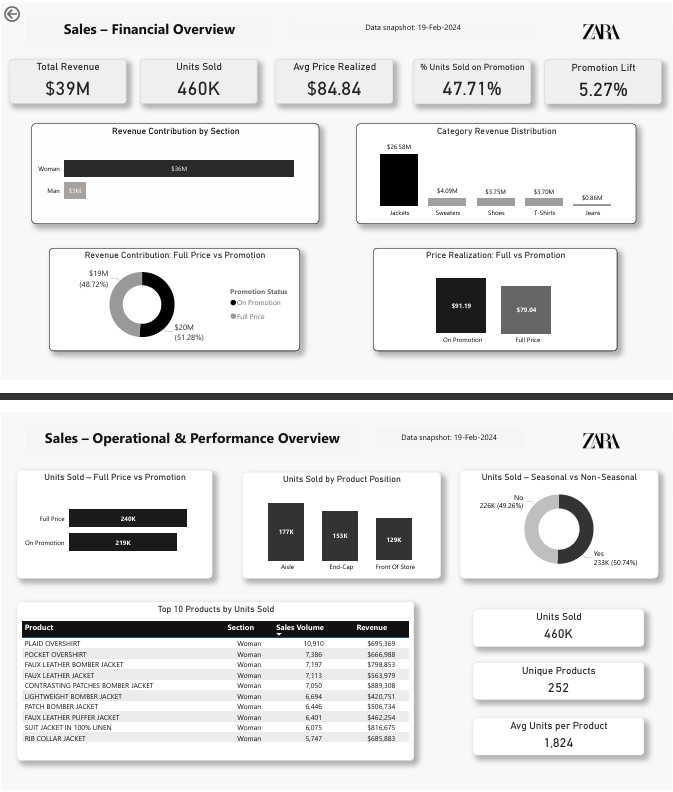

# ZARA Sales & Promotion Performance Dashboard

**2-page Power BI dashboard** analyzing real scraped ZARA sales data (10,000+ products, price, promotion, section, position).

**[View Report (PDF)](JEVH_ZARA_Sales_Operational_Dashboard.pdf)**

## Business Objective
Understand how **product placement**, **promotions**, and **assortment strategy** drive sales volume and revenue — and identify promotion efficiency.

## Key Insights
- Promotion rate varies significantly by section
- Main page and category page positions drive highest volume
- Some promotions reduce average price without proportional volume increase → inefficient
- Seasonal vs non-seasonal items show distinct patterns

## Dashboard Pages

### Page 1: Financial Overview
- KPI cards: Total Revenue, Units Sold, Promotion Rate, Avg Price
- Revenue by Section (Women, Men, TRF, Kids)
- Promotion vs Full-Price mix
- Trend analysis

### Page 2: Operational Deep Dive
- Units sold by product position
- Promotion impact on price and volume
- Seasonal vs non-seasonal performance
- Top 10 products table
- Operational KPIs (unique products, avg units per product)

## Files
- `.pbix` → Power BI source file
- `.pdf` → Static report

## Dataset
[ZARA Sales Dataset - Kaggle](https://www.kaggle.com/datasets/xontoloyo/data-penjualan-zara)

## Tools
- Power BI
- DAX
- Web scraping (data source)

---

**Eduardo** • Analytics & Finance  
[GitHub](https://github.com/villawolvesh) • [LinkedIn](https://www.linkedin.com/in/yourprofile)

Other projects:
- [Superstore Executive Dashboard (Python)](https://github.com/villawolvesh/superstore-executive-dashboard)
- [B2B Segment P&L (Power BI)](https://github.com/villawolvesh/b2b-segment-pnl)
